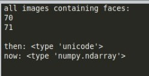

# Kafka distributed video streaming

Transmissão de vídeo utilizando Kafka/zookeeper e fazendo seu processamento com opencv-python.
O Kafka producer (```producer.py```) é responsável por efetuar a conversão dos frames do video para o formato de imagem '.jpg', enviá-los para algum determinado tópico e publicar o vídeo (formato base64). O consumer (```consumer.py```), acessa o tópico e cria o app web para mostrar a tranmissão do vídeo. Além disso, o ele também decodifica cada frame para o formato original e, utilizando o algoritimo de detecção de faces haar cascades, classifica as imagens contendo faces ou não. Se o frame contém um rosto, ele é salvo no banco de dados mongodb junto com:

- Bounding Box
- Timestamp
- Número do frame

A estrutura do elemento no mongodb segue o molde:

 ```python
 {
	"face": b64_img,
	"frame": frame,
	"boundingbox": boundingbox_coords,
	"timestamp": timestamp
} 
``` 

## Sumário

- [Instalação](#Instalação)
    - [Kafka](#instação-do-kafka)
    - [MongoDB](#instalção-do-mongodb)
    - [Bibliotecas](#bibliotecas-python-necessárias)
- [Como o projeto funciona](#como-o-projeto-funciona)
- [Como executar o programa](#como-executar-o-programa)
    - [Inicialização do Zookeeper](#inicialização-do-zookeeper)
    - [Inicialização do Kafka](#inicialização-do-kafka)
    - [Inicialização do MongoDB](#inicialização-do-mongoDB)
    - [Inicialização do Consumer](#inicialização-do-consumer)
    - [Inicialização do Producer](#inicialização-do-producer)
    - [Opcional](#opcional:-visualização-do-tráfego-de-dados-pelo-terminal)
    - [Detecção de faces e banco de dados](#detecção-de-faces-e-banco-de-dados)
- [Links](#links)

## Instalação

Para utilizar o projeto é importante que você esteja em uma máquina **Linux**.

### Instação do kafka

***** links kafka *****

### Instalção do mongodb

***** links mongo *****

### Bibliotecas python necessárias

***** links libs *****

## Como o projeto funciona

O algoritimo haar cascades utilizado funciona com maior precisão em rostos detectados **frontalmente**. Após detectar um rosto, o seu bounding box é gravado na imagem, como mostrado abaixo.

<p align="center">
  
</p>

Enquanto o kafka consumer está lendo o vídeo, as funções do programa **haarcascade_mongo.py** interpretam os frames e classifica cada um baseando-se no retorno da função ```is_face(img)```. Se um rosto for detectado na imagem, imediatamente a data e hora em que o evento ocorreu são salvas (timestamp), juntamente com seu boundingbox (coordenadas do retângulo de marcação do rosto) e número do frame no vídeo. O mais importante é salvar a imagem e suas informações no banco de dados, entretanto, elas também são salvas na pasta 'faces'apenas para obter uma visualização mais estética do desempenho do programa. 

<p align="center">
  
</p>

Frames sem rostos detectados são salvos na pasta 'not_face', porém esse também é um processo opcinal.

<p align="center">
  
</p>

Utilizando o programa **extract_from_database.py** é possível visualizar às imagens no mongodb. Uma opção é visualizar todos os frames com faces detectados, juntamente com o seu formato dentro do mongodb (base64) e seu formato após o ser decodificada, passando pela função ```decode_img(encoded_img)```.

<p align="center">
  
</p>

Também é possível ver o elemento no mongodb em seu format 'raw'.

<p align="center">
  
</p>

## Como executar o programa

Como dito acima, para que o projeto funcione, tanto o kafka, zookeeper e mongodb precisam estar sendo executados em segundo plano para que o projeto funcione. Para isso, siga os passos abaixo na ordem mostrada.

### Inicialização do Zookeeper

1. Abra um terminal linux (1° terminal utilizado).
2. Navegue até a pasta em que seu kafka foi extraido, no meu caso: ```cd Documents/kafka_2.11-2.4.1/```
3. Inicie o zookeeper com ```bin/zookeeper-server-start.sh config/zookeeper.properties```

### Inicialização do Kafka

1. Abra um terminal linux (2° terminal utilizado).
2. Navegue até a pasta em que seu kafka foi extraido, no meu caso: ```cd Documents/kafka_2.11-2.4.1/```
3. Inicie o kafka com ```bin/kafka-server-start.sh config/server.properties```

### Inicialização do MongoDB

1. Abra um terminal linux (3° terminal utilizado).
****pendente******

### Inicialização do Consumer

1. Abra um terminal linux (4° terminal utilizado).
2. Navegue até a pasta do projeto e em seguida entre na pasta **'src'**.
3. Inicie o **consumer**. ```python consumer.py```

Após alguns segundos o terminal irá mostrar uma mensagem informando que o consumer foi iniciado e aguarda transmissão.

Acesse o link:  http://0.0.0.0:5000/video e aguarde até que o producer inicie o envio de frames (próximo passo).

### Inicialização do Producer

1. Abra um terminal linux (5° terminal utilizado).
2. Navegue até a pasta do projeto e em seguida entre na pasta **'src'**.
3. Inicie o **producer** e informe o **vídeo que será utilizado no stream** digitando sua localização após o comando python que inicia o consumer, nesse caso irei utilizar o vídeo 'sample.mp4' localizado em '**./videos/sample.mp4**', mas você pode baixar/utilizar algum outro vídeo de sua preferência. ```python consumer.py ./videos/sample.mp4```

Se tudo ocorrer como esperado, o producer irá iniciar a transmissão. 
Atualize a [página web](http://0.0.0.0:5000/video) e vai ver o stream do vídeo escolhido.

### Opcional - visualização do tráfego de dados pelo terminal

1. Abra um terminal linux.
2. Navegue até a pasta em que seu kafka foi extraido, no meu caso: ```cd Documents/kafka_2.11-2.4.1/```
4. Inicie um Kafka consumer no terminal. **Importante: o nome do tópico deve ser o mesmo que está nos programas python, que por padrão é: distributed-video1**. ```bin/kafka-console-consumer.sh --bootstrap-server localhost:9092 --topic distributed-video1 --from-beginning```
5. Aguarde a transmissão do producer se iniciar para ver o tráfego dos dados no terminal.

Se você quiser **excluir** um tópico, utilize ``` bin/kafka-topics.sh --delete --zookeeper localhost:2181 --topic NOME_DO_TÓPICO```

### Detecção de faces e banco de dados

Agora que o vídeo está sendo transmitido, você pode utilizar o 4° terminal utilizado (**consumer.py**) para ver em que frame do vídeo a transmissão se encontra. Se algum rosto for detectado, você verá a mensagem 'face detected!'.

Após o stream ser finalizado, você pode utilizar a pasta 'faces' para checar de maneira rápida quais foram os frames com rosto detectado, assim como a pasta 'not_face' contendo os frames sem rosto.

Utilize as funcionalidades do programa ```extract_from_database.py``` para manipular e/ou acessar os elementos salvos no mongodb.

## Links

* [Kafka distributed](https://medium.com/@kevin.michael.horan/distributed-video-streaming-with-python-and-kafka-551de69fe1dd)
